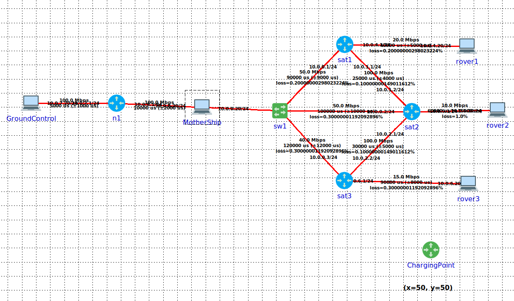

# CC


# Rover-Mission Simulation

Este projeto simula uma arquitetura completa de comunicação entre *MotherShip*, *Ground Control* e *Rovers*, utilizando o simulador CORE e uma aplicação distribuída composta por múltiplos módulos (telemetria, controlo de missão, fiabilidade, _mangers_ de estado, etc.).

---

## 📡 Topologia da Simulação

A topologia utilizada no cenário de testes é ilustrada abaixo:



A rede inclui:
- **GroundControl** → envia comandos e recebe telemetria, via API.
- **MotherShip** → núcleo central da missão; gere missões, telemetria, estado dos rovers, e implementa a API.
- **Satélites (sat1, sat2, sat3)** → fazem *routing* simulado com latências/restrições.
- **Rovers (rover1, rover2, rover3)** → executam missões, enviam telemetria.
- **ChargingPoint** → ponto de carregamento no mapa (ilustração do ponto fixo).

---

## ▶️ Como Iniciar a Topologia

Tendo o CORE a correr com a topologia em `TP2.xml`, basta executar:

```
./start.sh
```

Este script:
- Inicializa os serviços de todos os nodos principais (Rovers, MotherShip e GroundControl).
- Executa o `firefox` a partir do GroundControl para visualização da página Web de controlo.

---

## 🧪 Como Executar Testes Automáticos

Os testes de missão são executados através de:

```
./run_tests.sh X
```

Onde **X** é o número do teste que pretende executar.

Exemplos:

- Executar apenas o teste 1:

```
./run_tests.sh 1
```

- Executar o teste 3:

```
./run_tests.sh 3
```

- Executar *todos* os testes:

```
./run_tests.sh
```

*Nota:* os testes implementados estão descritos em `tests/mission_scenarios.yaml`.

---

## 📁 Ficheiros Importantes

| Ficheiro | Descrição |
|---------|-----------|
| `start.sh` | Lança a topologia CORE e arranca todos os processos |
| `run_tests.sh` | Executa os cenários definidos em `mission_scenarios.yaml` |
| `tests/mission_scenarios.yaml` | Define missões usadas nos testes automáticos |
| `mothership/` | Código do servidor principal e dos módulos |
| `rovers/` | Código dos rovers, telemetria, heartbeat e execução de missões |
| `ground_control/` | Código de implementação do nó GroundControl |  
| `mission_link/` | Código associado ao protocolo UDP de comunicação de Missões |
| `telemetry/` | Código associado ao protocolo sobre TCP de transmissão de telemetria periódica |
| `api/` | Código relativo à API com WebSocket que é executada na MotherShip |
| `common/protocol_config.py` | Configuração relativa a todos os protocolos |
| `common/message_types.py` | Implementação principal dos 3 tipos de mensagens e tipos auxiliares |

---

Trabalho desenvolvido no âmbito do projeto de **Comunicações por Computador do 3ºano da Licenciatura em Engenharia Informática**.

---
