# Interface Pessoa-Máquina

**Autores:**  
- Afonso Martins (a106931)  
- Luis Felício (a106913)  
- Gonçalo Castro (a107337)  

**Data:** 19 de Outubro de 2025  

---

**[Link Mockup no Figma](https://www.figma.com/design/fjceqQN1Hykbz3q1x8K4AZ/IPM_mockup?node-id=0-1&t=FGnJpNyZJT06Eb2Z-1)**

---

## Heurística - Guidelines utilizadas

### 1. Visibilidade do estado do sistema
_Manter os utilizadores informados sobre o que se passa, através de feedback apropriado._

O dashboard apresenta valores atualizados, índices de variação (+8.2%, -2.1%) e ícones de tendência (setas e cores), mostrando o estado atual dos dados.

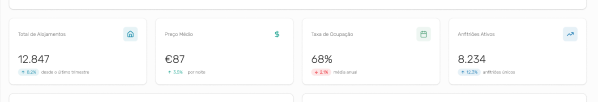

O utilizador vê claramente que está na secção ativa (por exemplo, “Vista Geral”, “Análise Temporal”), com realce visual no menu lateral.

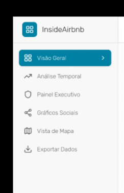
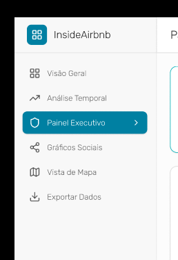

---

### 2. Correspondência entre o sistema e o mundo real
_Falar a língua dos utilizadores (palavras, frases e conceitos familiares, em vez de jargão interno). Apresentar a informação numa ordem natural e lógica._

Uso de palavras comuns e que são usadas no dia a dia como por exemplo "Preço médio" e "Listagens por tipo", etc...

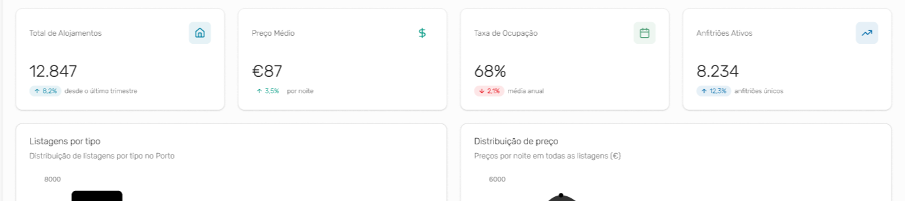

---

### 3. Controlo e liberdade do utilizador
_Os utilizadores executam frequentemente ações por engano. Fornecer “saídas de emergência” claramente marcadas._

_Sidebar_ lateral com menus como "Visão Geral", "Análise Temporal" e "Exportar Dados", permitindo alternar secções.

Filtros e opções de diferentes vistas das tabelas e gráficos dão controlo ao utilizador para personalizar e focar no que está à procura.

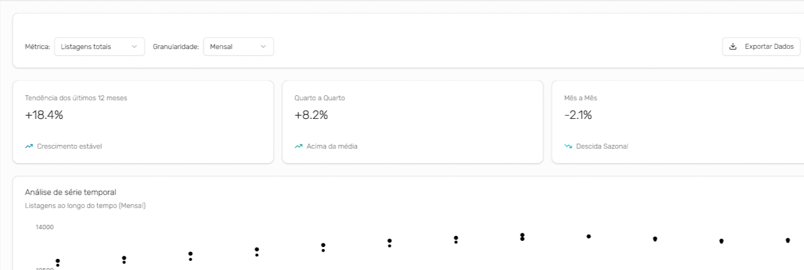
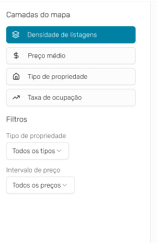

---

### 4. Consistência e normas
_Palavras, situações, ou ações diferentes devem ter significados diferentes. Seguir as convenções da plataforma e da indústria._

Ícones das páginas são consistentes e globalmente reconhecíveis, cores do layout são uniformes e a _sidebar_ comporta-se da mesma maneira em todas as páginas.

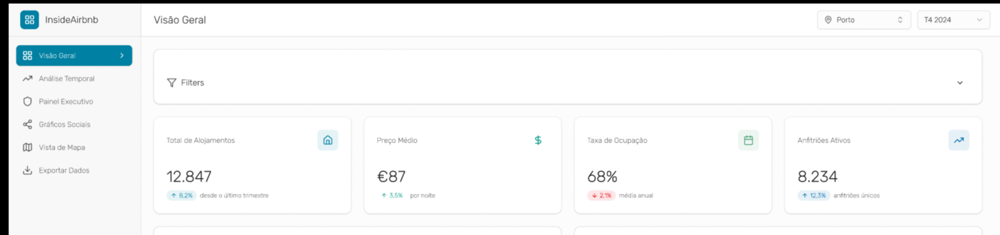
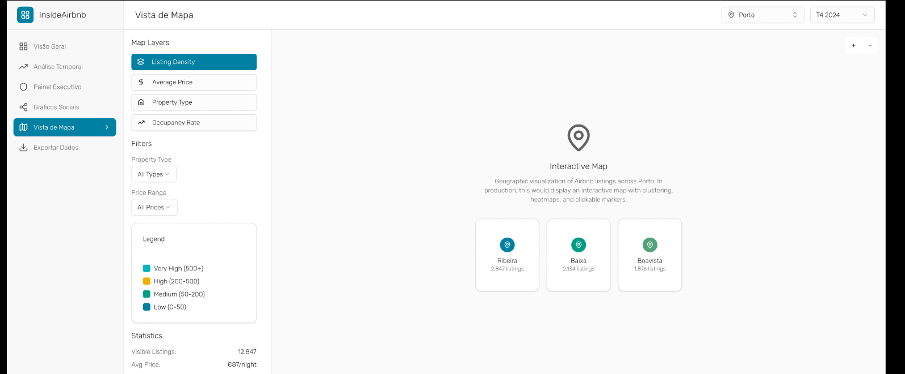

---

### 5. Prevenção de erros
_Boas mensagens de erro são importantes, mas ainda mais é evitar a ocorrência de problemas._

Mensagens de erro, para exceções nas ações do utilizador, como por exemplo na tentativa de exportação sem definir formato.

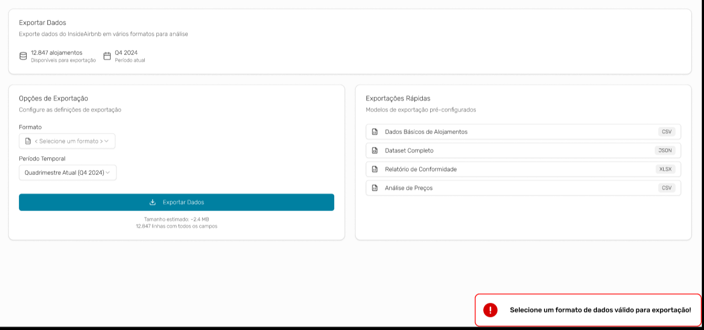

---

### 6. Reconhecer em vez de recordar
_Minimizar a carga de memória do utilizador.  
A informação necessária deve ser visível ou facilmente recuperável._

O utilizador não precisa de memorizar informação — está tudo visível em gráficos/cartões.

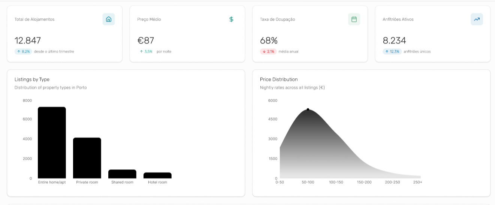

Informações de filtros como "Porto" e "T4 2024" estão sempre visíveis em todas as páginas, retirando a necessidade de memorização de informação ao utilizador.

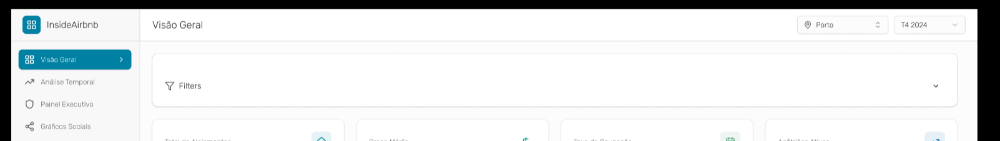
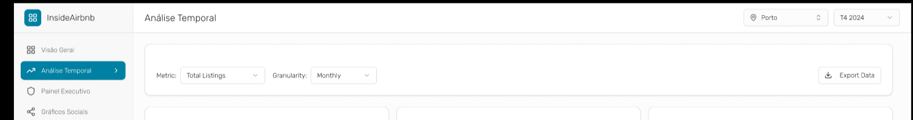

---

### 7. Flexibilidade e eficiência de utilização
_Os atalhos (ocultos dos utilizadores principiantes) podem acelerar a interação para o utilizador experiente._

O sistema oferece filtros dinâmicos (métrica, granularidade, período, cidade), permitindo personalizar a análise.

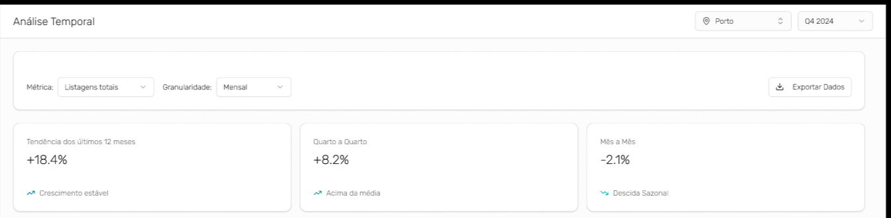

Funções como a exportação de dados para diferentes formatos permitem uma experiência mais eficiente e adaptada às necessidades de utilizadores avançados.

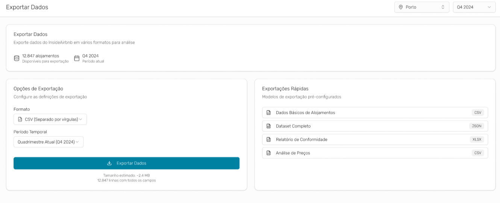

---

### 8. Desenho estético e minimalista
_As interfaces não devem conter informação que seja irrelevante ou raramente necessária._

Design limpo e espaçamento adequado entre secções da aplicação, sem ter componentes desnecessários.

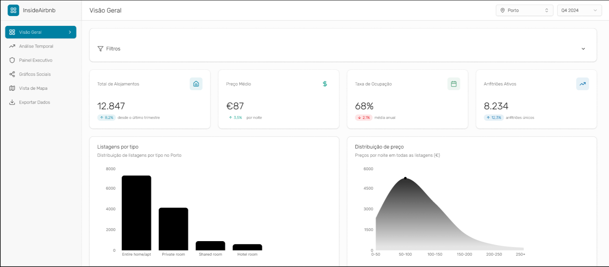

---

### 9. Ajudar os utilizadores a reconhecer, diagnosticar e recuperar de erros
_Expressar mensagens de erro em linguagem simples (sem códigos de erro), indicando o problema e possível solução._

Identificação do erro e da sua gravidade, botão de ação para corrigir erro, _overview_ da quantidade de erros e do seu tipo e detalhes associados a cada erro.

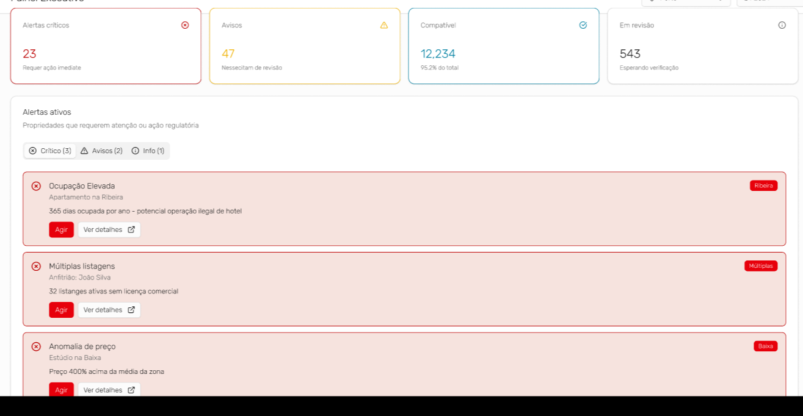

---

### 10. Ajuda e documentação
_É melhor se o sistema não precisar de qualquer explicação adicional, mas pode ser necessário fornecer informação._

Pequenos subtítulos explicativos do que a página faz ou sobre o conteúdo dos componentes ou tabelas ajudam o utilizador a perceber a sua utilidade.

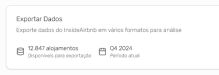

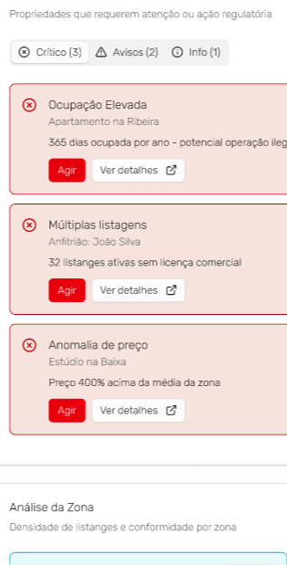

---

## De que forma a interface proposta responde às necessidades dos perfis definidos

### Perfil 1: José Silva
- **Análise Temporal Detalhada:** Gráficos de séries temporais (ex.: barras 2023–2024) atendem à necessidade de rastreamento mensal.  
  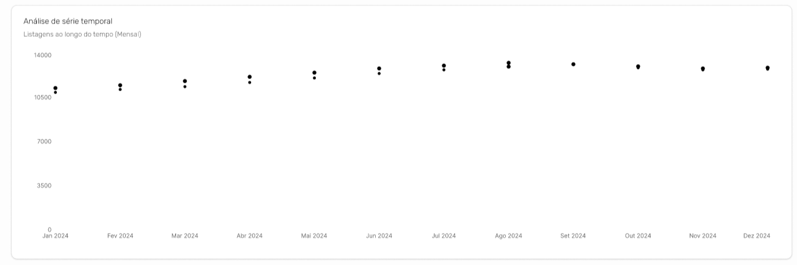

- **Filtros Complexos:** Filtros por tipo, localização e preço reduzem esforço de limpeza.  
  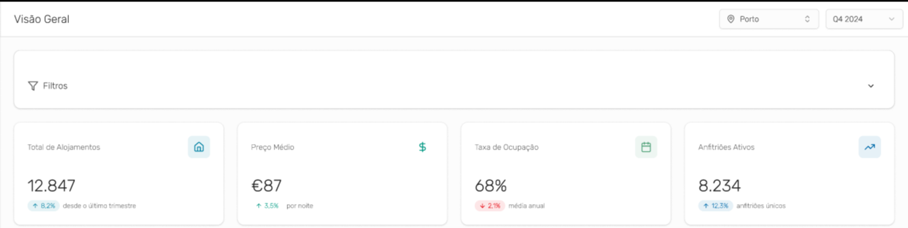

- **Exportação de Resultados:** CSV, JSON, XLSX em "Exportar Dados" minimizam tempo de coleta.  
  

---

### Perfil 2: Maria Santos
- **Dashboards Executivos:** KPIs e alertas em vermelho (ex.: 543 anomalias) facilitam regularização.  
- **Alertas para Anomalias:** Tabelas destacam ocupação >300 dias/ano.  
  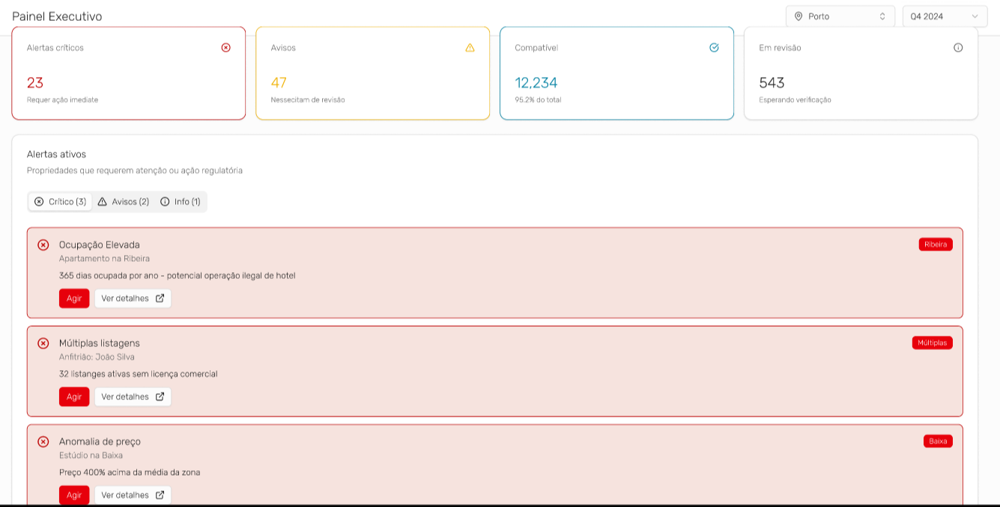

- **Mapeamento por Zonas:** Mapa com _pins_ por zona suporta o planeamento urbano.  
  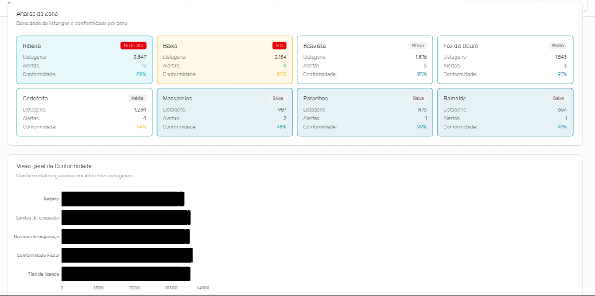
  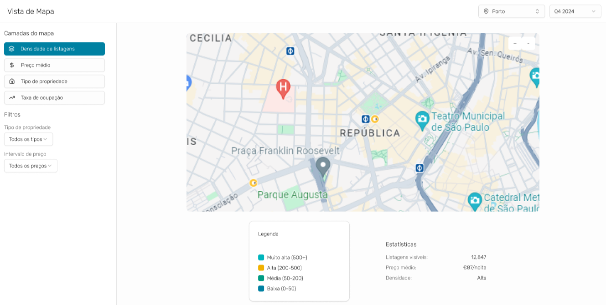

---

### Perfil 3: António Costa
- **Gráficos Simples e Impactantes:** Barras e curvas minimalistas são ideais para redes sociais.  
- **Dados Comparativos:** Tabelas comparam zonas e tipos de propriedades.  
  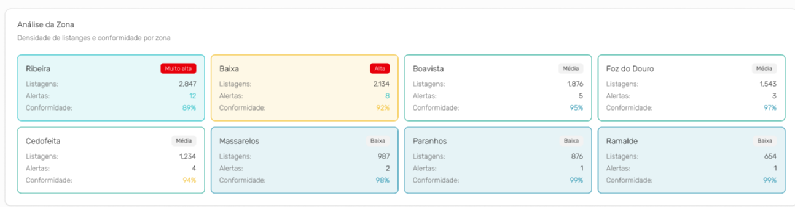
  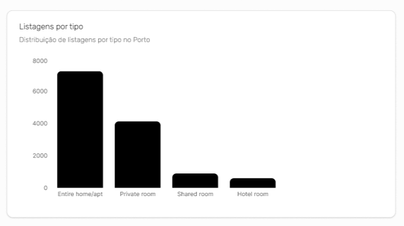

- **Exemplos de Casos Emblemáticos:** Mapa destaca áreas densas (ex.: Baixa) e casos alertados.  
  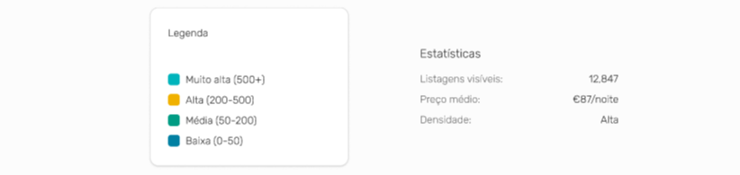

---

### Conclusão
A interface destaca-se pela sua capacidade de atender eficazmente às necessidades de diversos perfis, oferecendo camadas progressivas que se adaptam a diferentes níveis de _expertise_, promovendo uma experiência intuitiva e funcional para todos os utilizadores.
