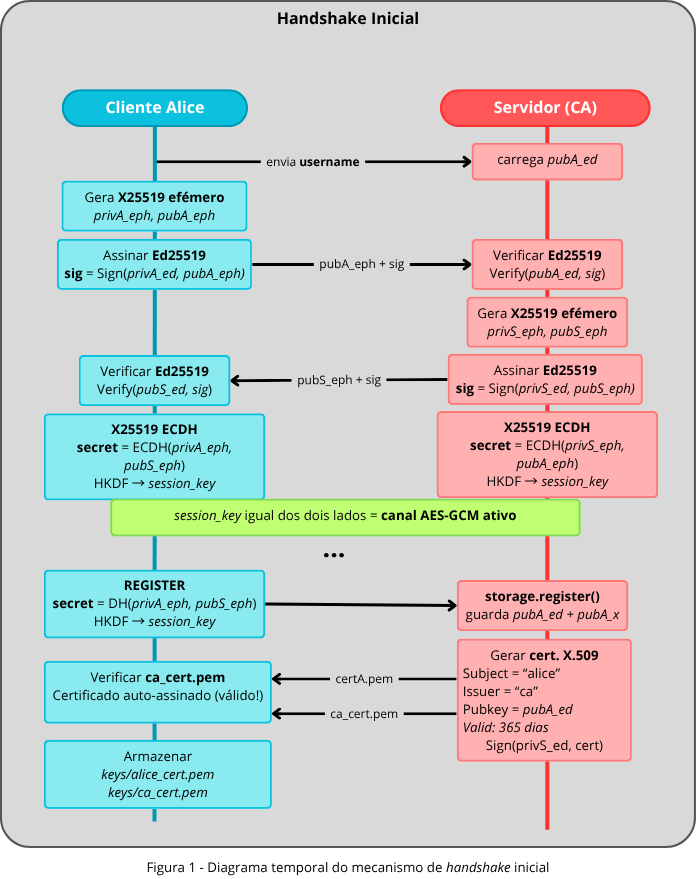
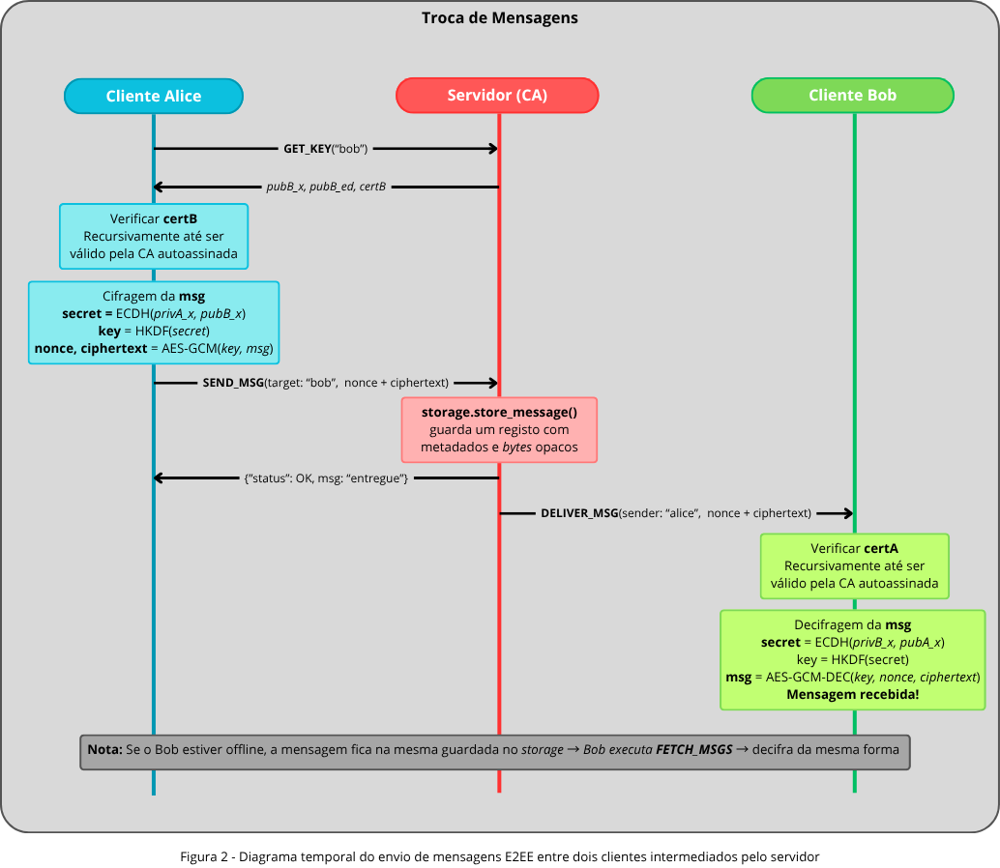

# Sistema de Chat E2EE - Segurança de Sistemas Informáticos

Trabalho realizado por:

- **Gonçalo Faria Gonçalves** - a100833
- **Gonçalo José Vieira de Castro** - a107337
- **Afonso Paulo Martins** - a106931

---

# 1. Introdução

Este projeto implementa um sistema de conversa (_chat_) cliente-servidor com **End-to-End Encryption (E2EE)**, desenvolvido em _Python_ com recurso à biblioteca `cryptography`. O sistema garante propriedades fundamentais de segurança, nomeadamente confidencialidade, integridade, autenticidade e proteção contra ataques clássicos.

O modelo de ameaça assumido considera o servidor como **"honesto mas curioso"**. Isto significa que o servidor encaminha e armazena mensagens corretamente, mas não deve possuir capacidade técnica para ler o conteúdo das comunicações entre utilizadores.

A arquitetura foi concebida segundo princípios modernos de criptografia aplicada, combinando criptografia simétrica, criptografia assimétrica, certificados X.509, derivação segura de chaves e autenticação baseada em _password_.

O sistema suporta múltiplos utilizadores por dispositivo, mensagens offline, entrega em tempo real e troca autenticada de chaves.

---

# 2. Arquitetura Geral do Sistema

A arquitetura encontra-se dividida em quatro camadas principais de segurança.

## 2.1 Autenticação Local com Password

Antes de qualquer ligação ao servidor, o cliente exige autenticação local através de _username_ e _password_. A _password_ é validada contra um hash Argon2id armazenado em:

```text
keys/users.json
```

Este mecanismo é a **primeira linha de defesa do sistema**: sem a password correta, as chaves criptográficas locais nunca são carregadas e a ligação ao servidor nunca é iniciada. Impede que um atacante com acesso ao sistema de ficheiros consiga utilizar as chaves privadas de outro utilizador sem conhecer a respetiva _password_.

A aplicação suporta múltiplos utilizadores no mesmo dispositivo e permite realizar login e logout sem reiniciar o processo.

## 2.2 Canal Seguro Cliente ↔ Servidor

A comunicação TCP é protegida por um protocolo proprietário inspirado em TLS e Station-to-Station. O _handshake_ utiliza **X25519 efémero** para acordo de chaves e **Ed25519** para autenticação.

Após o _handshake_, ambas as partes derivam uma chave simétrica através de **HKDF-SHA256** e utilizam **AES-GCM** para cifragem autenticada do canal.

Esta camada garante:

- **confidencialidade** (as mensagens são cifradas com AES-GCM usando uma chave de sessão derivada do segredo ECDH, impedindo terceiros de lerem o conteúdo);
- **integridade** (AES-GCM inclui autenticação criptográfica do ciphertext através de uma _authentication tag_, permitindo detetar qualquer alteração maliciosa aos dados);
- **autenticidade** (as chaves efémeras trocadas no _handshake_ são assinadas com Ed25519, permitindo verificar a identidade da contraparte);
- **proteção contra MITM** (um atacante não consegue substituir chaves públicas no _handshake_ sem invalidar as assinaturas digitais verificadas pelos certificados X.509);
- **Perfect Forward Secrecy (PFS)** (cada sessão utiliza chaves X25519 efémeras novas, garantindo que o compromisso futuro de uma chave de longa duração não permite decifrar sessões passadas).



## 2.3 Segurança End-to-End (E2EE)

As mensagens são cifradas no cliente remetente e apenas podem ser decifradas pelo cliente destinatário.

O servidor nunca possui as chaves E2EE nem tem acesso ao _plaintext_ das mensagens. Apenas armazena:

- remetente;
- destinatário;
- timestamps;
- ciphertext (mensagem opaca e sem qualquer associação à mensagem original).

## 2.4 PKI e Certificados X.509

O servidor atua como Autoridade Certificadora (CA), emitindo **certificados X.509** assinados para cada cliente.

Cada utilizador possui:

- uma chave Ed25519 para identidade e assinaturas;
- uma chave X25519 para acordo de chaves ECDH;
- um certificado X.509 assinado pela CA.

Antes de utilizar uma chave pública, os clientes validam:

- a assinatura da CA;
- o Common Name (CN);
- a integridade do certificado.

Este mecanismo impede ataques de substituição de chaves públicas e _impersonation_ (quando um atacante tenta fazer-se passar por outra pessoa).

Os dados guardados no servidor (ficheiro `data/history/server_db.json`) contêm apenas as chaves públicas dos utilizadores e as mensagens cifradas. Os hashes das passwords nunca saem do dispositivo do cliente.

---

# 3. Fluxo Geral do Sistema

## 3.1 Registo Inicial

Durante o primeiro login:

1. o utilizador define uma password;
2. é criado um hash Argon2id e escrito em `keys/users.json`;
3. são geradas chaves Ed25519 e X25519;
4. o cliente regista-se no servidor;
5. o servidor emite um certificado X.509.

## 3.2 Login e Gestão de Estado

Ao executar o cliente, é imediatamente apresentado um prompt interativo. O processo não termina em caso de credenciais erradas — volta a pedir até um login bem-sucedido ou Ctrl+C:

```
=== Sistema de Chat E2EE ===

Username: alice
Password: ████████
[+] Autenticado como 'alice'.
```

A **fonte única de verdade** para a existência de uma conta local é a entrada correspondente em `users.json`. Os ficheiros `.pem` das chaves são tratados como estado derivado — podem ser regenerados após uma autenticação válida, mas nunca atribuem identidade por si próprios. Esta decisão de design elimina a possibilidade de estados inconsistentes em que o sistema confunde restos de uma instalação anterior com uma conta legítima.

O comportamento é determinado pelo cruzamento entre `users.json` e os ficheiros em disco:

- **Conta existente em `users.json` com chaves em disco (caso normal):** A password é verificada contra o hash; em caso de sucesso, as chaves locais são carregadas.
- **Conta existente em `users.json` sem chaves em disco:** Após verificação da password, o sistema avisa o utilizador que as chaves vão ser regeneradas e remove ficheiros `.pem` parciais que possam ter ficado. O cliente segue para o registo no servidor, que aceita o upsert e substitui as chaves públicas antigas — as conversas com peers que ainda tenham a chave anterior em cache deixam de funcionar até nova obtenção via `GET_KEY`.
- **Conta ausente de `users.json` mas com chaves órfãs em disco:** Estado inconsistente residual (ex: `users.json` apagado manualmente, ou cópia parcial de outra instalação). O sistema pede confirmação explícita antes de remover as chaves antigas e prosseguir com a criação de uma nova conta.
- **Conta nova (nada em disco):** Pede password com confirmação, escreve o hash em `users.json` e prossegue para gerar as chaves criptográficas.

### Logout

O comando `logout` encerra o socket, limpa todo o estado em memória (chaves, cache E2EE, fila de respostas) e volta ao ecrã de login — sem reiniciar o processo. É possível autenticar com uma conta diferente de seguida.

## 3.3 Envio de Mensagens

Quando um utilizador envia uma mensagem:

1. o cliente obtém o certificado do destinatário via `GET_KEY`;
2. valida a assinatura da CA e o Common Name;
3. deriva uma chave E2EE via X25519 + HKDF;
4. cifra a mensagem com AES-GCM;
5. envia o ciphertext ao servidor.

## 3.4 Receção de Mensagens

O destinatário recebe o ciphertext, deriva a mesma chave E2EE e decifra a mensagem localmente. O servidor nunca tem acesso ao plaintext em nenhum dos modos de entrega.

---

# 4. Entrega de Mensagens

O sistema suporta entrega _online_ e _offline_.

Quando o destinatário está _online_, o servidor encaminha imediatamente a mensagem através da ação `DELIVER_MSG`. O cliente possui uma _listener thread_ em background que recebe e decifra mensagens em tempo real sem interromper a REPL. As mensagens entregues em tempo real são igualmente persistidas no servidor para garantir histórico consistente, mesmo que o cliente destino falhe entre a entrega e a persistência local.

Caso o destinatário esteja _offline_, a mensagem permanece armazenada no servidor até que o utilizador execute o comando `fetch`. As mensagens são removidas do servidor após entrega.

Em ambos os casos, o servidor nunca tem acesso ao plaintext.



---

# 5. Autenticação Local com Argon2id

O sistema utiliza Argon2id através da biblioteca `argon2-cffi`, o algoritmo vencedor da Password Hashing Competition (2015) e recomendado pela OWASP para hashing de passwords.

## 5.1 Estrutura do users.json

O ficheiro agrega todos os utilizadores registados na máquina num único documento JSON:

```json
{
  "users": {
    "alice": {
      "password_hash": "$argon2id$v=19$m=65536,t=3,p=4$..."
    },
    "bob": {
      "password_hash": "$argon2id$v=19$m=65536,t=3,p=4$..."
    }
  }
}
```

O hash segue o formato PHC e inclui o salt, o algoritmo e os parâmetros de custo — não é necessário armazenar o salt separadamente. O ficheiro nunca é transmitido ao servidor.

## 5.2 Parâmetros Utilizados

| Parâmetro     | Valor         |
| ------------- | ------------- |
| Algoritmo     | Argon2id      |
| `time_cost`   | 3 iterações   |
| `memory_cost` | 65 536 KiB    |
| `parallelism` | 4 threads     |

Os parâmetros seguem as recomendações da OWASP 2024 para autenticação interativa.

## 5.3 Rehash Transparente

Caso os parâmetros de custo sejam alterados no código, o sistema atualiza automaticamente o hash do utilizador em `users.json` no próximo login bem-sucedido, sem qualquer intervenção manual.

## 5.4 Concorrência e Atomicidade das Escritas

Todas as operações sobre `users.json` (`_load_users` + modificação + `_save_users`) decorrem sob um `threading.Lock` dedicado (`_users_json_lock`), garantindo que escritas concorrentes pelo thread principal não corrompem o ficheiro. A escrita é **atómica ao nível do sistema de ficheiros**: o conteúdo é primeiro escrito num ficheiro temporário `users.json.tmp` e só depois movido para o destino com `os.replace()`, evitando que um crash a meio da escrita deixe o ficheiro parcialmente válido.

O mesmo padrão é aplicado ao histórico local (`<username>_history.json`), que é acedido em paralelo pelo _listener thread_ (mensagens em tempo real via `DELIVER_MSG`) e pelo thread principal (mensagens diferidas via `fetch`). Um lock dedicado (`_history_lock`) serializa o ciclo _read-modify-write_, e `os.replace()` garante atomicidade da escrita.

## 5.5 Eliminação de Conta

Ao usar o comando `delete`, a entrada do utilizador é removida de `users.json` juntamente com todos os ficheiros de chaves locais (`_priv_ed.pem`, `_pub.pem`, `_priv_x.pem`, `_cert.pem`), garantindo que não ficam vestígios da conta no dispositivo.

---

# 6. Autoridade Certificadora (CA)

No primeiro arranque, o servidor gera automaticamente:

- uma chave privada Ed25519 de longa duração para identidade e assinatura de certificados;
- um certificado X.509 auto-assinado (`keys/server/ca_cert.pem`) que serve de âncora de confiança para toda a PKI.

Os ficheiros gerados incluem:

```text
keys/server/server_ed25519.pem
keys/server/ca_cert.pem
```

Em cada ligação de um cliente:

1. O servidor executa o handshake seguro e envia o certificado da CA ao cliente.
2. Ao processar o comando `REGISTER`, o servidor gera (ou re-gera) um **certificado X.509** com o `Common Name` igual ao username do cliente, assinado pela sua chave privada Ed25519.
3. O certificado é enviado ao cliente para armazenamento local (`keys/<username>_cert.pem`).
4. O certificado da CA é igualmente distribuído a todos os clientes (`keys/ca_cert.pem`), permitindo a verificação da cadeia de confiança.

### Verificação de Identidade entre Clientes

Quando um cliente pede as chaves de outro utilizador (`GET_KEY`), o servidor inclui o certificado X.509 desse utilizador na resposta. O cliente executa duas verificações antes de qualquer operação criptográfica:

1. **Validação da cadeia de confiança** — a assinatura do certificado é verificada contra o certificado da CA armazenado localmente.
2. **Correspondência de identidade** — o `Common Name` do certificado é comparado com o username esperado, prevenindo ataques de substituição.

Esta verificação ocorre em `send` (antes de cifrar) e em `fetch` (antes de decifrar). As chaves E2E verificadas são guardadas em cache local para evitar chamadas repetidas ao servidor.

---

# 7. Justificação Criptográfica

## 7.1 Argon2id

Argon2id é utilizado para hashing de passwords. Trata-se de um algoritmo _memory-hard_, resistente a ataques acelerados por GPU e ASIC graças ao custo de memória configurável. É adicionalmente candidato a KDF para cifra de chaves em disco (ver secção 11.1).

## 7.2 Ed25519

Ed25519 é utilizado para assinaturas digitais e autenticação. Oferece elevada performance, chaves pequenas e resistência a ataques de _side-channel_. É usado pelo servidor para assinar certificados X.509 e por ambas as partes para autenticar as chaves efémeras no handshake.

## 7.3 X25519

X25519 é utilizado para acordo de chaves ECDH — tanto no canal de transporte (com chaves efémeras) como no canal E2EE (com chaves estáticas de longa duração). Está matematicamente separado do Ed25519: é otimizado para troca de segredos, não para assinaturas.

## 7.4 HKDF-SHA256

HKDF-SHA256 é utilizado para derivar chaves simétricas a partir dos segredos obtidos por ECDH. O resultado direto do ECDH não é uma chave uniformemente aleatória — o HKDF extrai a sua entropia e expande-a para 32 bytes prontos a usar em AES-256.

O sistema utiliza contextos distintos através do parâmetro `info`, garantindo que chaves derivadas para fins diferentes nunca colidem:

- `tcp_transport_kdf` — canal de transporte cliente ↔ servidor;
- `chat_e2ee` — cifra E2EE cliente ↔ cliente.

## 7.5 AES-GCM

AES-GCM é utilizado como mecanismo AEAD (_Authenticated Encryption with Associated Data_), garantindo simultaneamente:

- **confidencialidade** — o conteúdo é cifrado e ilegível sem a chave;
- **integridade** — qualquer adulteração do ciphertext invalida a _authentication tag_ e a decifragem é rejeitada (`InvalidTag`);
- **autenticação do ciphertext** — confirma que o ciphertext foi produzido por quem detém a chave.

Os nonces de 96 bits são gerados com `os.urandom(12)`, seguindo o standard NIST para GCM.

---

# 8. Comandos Disponíveis

| Comando         | Descrição                                                                 |
| --------------- | ------------------------------------------------------------------------- |
| `list`          | Lista todos os utilizadores registados no servidor                        |
| `send <user>`   | Envia mensagem cifrada E2EE; se o destinatário estiver online, entrega imediata |
| `fetch`         | Obtém e decifra mensagens pendentes armazenadas no servidor               |
| `logout`        | Termina a sessão, limpa estado em memória e volta ao ecrã de login        |
| `delete`        | Remove conta no servidor, apaga chaves locais e entrada em `users.json`   |
| `quit`          | Fecha a ligação ao servidor e termina o processo                          |

---

# 9. Como Executar

## 9.1 Dependências

```bash
pip install cryptography argon2-cffi
```

## 9.2 Servidor

```bash
python server.py
```

No primeiro arranque, o servidor gera automaticamente o par de chaves Ed25519, o certificado X.509 auto-assinado da CA (`keys/server/ca_cert.pem`) e a chave pública do servidor (`keys/server_pub.pem`).

## 9.3 Cliente

```bash
python client.py
```

O username não é passado como argumento — é pedido interativamente juntamente com a password. No primeiro uso, o cliente pede para definir uma nova password e cria a entrada em `users.json`. Nos usos seguintes, verifica a password contra esse ficheiro antes de carregar as chaves ou ligar ao servidor. Múltiplos utilizadores podem partilhar o mesmo dispositivo, cada um com a sua entrada em `users.json` e as suas chaves separadas.

## 9.4 Cenário de Demonstração

1. Inicie o servidor e o cliente num terminal. Introduza o username `alice` e defina uma password (primeiro uso).
2. Num segundo terminal, inicie outro cliente, introduza `bob` e defina uma password.
3. No terminal da Alice, escreva `list` — deve ver o bob.
4. Escreva `send bob` e quando pedido, escreva `Olá Bob, este é o nosso segredo.`
5. Observe no terminal do servidor que recebe um pacote `SEND_MSG` e armazena bytes opacos — **não consegue ver o texto**.
6. Se o Bob estiver online no momento do envio, a mensagem aparece automaticamente no seu terminal (entrega em tempo real). Caso contrário, no terminal do Bob escreva `fetch`.
7. Escreva `logout` no terminal da Alice — o ecrã de login reaparece e pode autenticar com outra conta sem reiniciar o processo.

---

# 10. Ficheiros Gerados

| Ficheiro | Descrição |
|---|---|
| `keys/server/server_ed25519.pem` | Chave privada Ed25519 do servidor (também usada como CA) |
| `keys/server/ca_cert.pem` | Certificado X.509 auto-assinado da CA |
| `keys/server_pub.pem` | Chave pública do servidor (distribuída aos clientes) |
| `keys/ca_cert.pem` | Cópia do certificado da CA para os clientes |
| `keys/users.json` | Base de dados local de contas: username + hash Argon2id (nunca transmitido) |
| `keys/<username>_priv_ed.pem` | Chave privada Ed25519 do cliente |
| `keys/<username>_pub.pem` | Chave pública Ed25519 do cliente |
| `keys/<username>_priv_x.pem` | Chave privada X25519 do cliente (E2EE) |
| `keys/<username>_cert.pem` | Certificado X.509 do cliente, assinado pela CA |
| `keys/clients/<username>_cert.pem` | Cópia do certificado do cliente armazenada no servidor |
| `data/history/server_db.json` | Base de dados do servidor: chaves públicas e mensagens cifradas pendentes |
| `data/history/<username>_history.json` | Histórico local de mensagens recebidas (plaintext, apenas no dispositivo do cliente) |

---

# 11. Limitações Assumidas

Esta secção lista limitações inerentes ao modelo de ameaça adotado — decisões deliberadas que delimitam o âmbito do projeto, não defeitos da implementação. As fragilidades técnicas concretas e as suas mitigações são tratadas na secção 12.

- **Servidor honesto mas curioso, não malicioso.** O modelo assume que o servidor encaminha mensagens corretamente e não tenta forjar identidades nem injetar conteúdo. Um servidor totalmente malicioso, ao ser também a CA, poderia emitir certificados fraudulentos — vetor discutido em 12.1 e mitigável através de _safety numbers_ e CRL.
- **Metadados visíveis ao servidor.** O servidor observa quem comunica com quem, quando e com que frequência. Mitigar isto exigiria reescrever o modelo de transporte (e.g., _mixnet_ ou _Sealed Sender_) e está fora do âmbito.
- **Modelo de adversário com acesso ao filesystem do cliente.** O Argon2id em `users.json` impede o uso indevido das chaves _através da aplicação_, mas as chaves privadas em si ficam em disco sem cifra adicional. Um atacante com leitura ao disco extrai-as diretamente. A solução (cifra de envelope com chave derivada da password) está descrita em 12.1.
- **Distribuição inicial da chave pública do servidor.** A obtenção de `keys/server_pub.pem` é feita via filesystem partilhado entre cliente e servidor (assunção académica de bootstrap). Num cenário real, esta chave seria distribuída via canal autenticado (e.g., embebida no binário ou obtida via TLS para um _trust anchor_ conhecido).
- **Histórico local não cifrado.** O histórico de mensagens guardado em `data/history/<username>_history.json` contém texto em claro. Um atacante com acesso ao sistema de ficheiros do cliente pode lê-lo.

---

# 12. Análise Crítica e Trabalho Futuro

Esta secção identifica as fragilidades concretas da implementação atual e a sua evolução natural, separadas das melhorias puramente aditivas.

## 12.1 Fragilidades Identificadas e Mitigações Propostas

- **Reutilização de nonce no E2EE.** As chaves E2E são estáticas (derivadas uma vez por ECDH entre cada par) e os nonces de 96 bits do AES-GCM são gerados com `os.urandom(12)`. Pelo paradoxo do aniversário, o limite seguro situa-se em ~2³² mensagens por par (NIST SP 800-38D), após o qual uma colisão compromete os dois plaintexts envolvidos. **Mitigação imediata:** contador determinístico persistido por sessão, estendendo o limite para ~2⁶⁴. **Mitigação estrutural:** Double Ratchet (ver abaixo).
- **Ausência de Forward Secrecy no E2EE.** O canal de transporte tem PFS via chaves efémeras assinadas no handshake, mas as chaves E2E derivam de pares X25519 de longa duração em disco — se uma chave privada for comprometida, todas as mensagens passadas capturadas pelo servidor podem ser decifradas. **Mitigação:** **Double Ratchet** (Signal), combinando _symmetric ratchet_ (FS dentro da sessão) e _DH ratchet_ (post-compromise security). Resolve simultaneamente o problema do nonce reuse, dado que cada mensagem é cifrada com chave fresca.
- **Chaves privadas e histórico em disco sem cifra.** Os ficheiros `_priv_ed.pem`, `_priv_x.pem` e `<username>_history.json` estão protegidos pelo Argon2id apenas _através da aplicação_ — um atacante com leitura ao disco extrai-os diretamente. **Mitigação:** derivar uma chave de envelope da password (Argon2id-as-KDF) e cifrar estes ficheiros com AES-GCM, decifrando apenas após login válido.
- **Modelo de confiança centralizado na CA.** O servidor é simultaneamente intermediário e CA — se comprometido, pode emitir certificados fraudulentos. **Mitigações complementares:** (i) CRL ou OCSP-like leve para revogação; (ii) _safety numbers_ comparáveis out-of-band, à semelhança do Signal; (iii) registo dos certificados emitidos em log auditável, inspirado em _Certificate Transparency_.

## 12.2 Comparação com OpenPGP

É útil situar este sistema face ao PGP/MIME, o exemplo canónico de E2EE sem CA. No PGP, a vinculação chave–identidade depende de comparação manual de _fingerprints_ ou da _web of trust_, o que abre dois vetores: **substituição silenciosa de chave** (um atacante interpõe uma chave forjada via keyserver ou email, sem aviso ao cliente) e **ausência de validação automática no momento da cifra** (o cliente apenas verifica que a chave é sintaticamente válida).

Este projeto não sofre destes problemas por uma decisão de design explícita: antes de cifrar ou aceitar uma chave via `GET_KEY`, o cliente valida o certificado X.509 do peer contra a CA local e confirma que o `Common Name` corresponde ao username esperado (`verify_peer_certificate` em `client.py`). Falhando qualquer das verificações, a operação é cancelada. A CA — mesmo centralizada — substitui a verificação manual de fingerprints por uma decisão criptográfica determinística e obrigatória ("fail-secure"), eliminando o vetor de substituição silenciosa.

Esta abordagem desloca o risco para o comprometimento da CA em vez de o eliminar — compensação consciente, e a razão pela qual as mitigações em 12.1 (CRL, _safety numbers_, transparência) constituem a evolução natural. Note-se que o Signal mitiga o mesmo risco via _safety numbers_, mas estudos de usabilidade mostram que raramente são comparados pelos utilizadores.

## 12.3 Melhorias Funcionais

- **Cifra das chaves e histórico em disco:** derivar uma chave de cifra a partir da password (Argon2id-as-KDF) e cifrar os ficheiros `_priv_ed.pem`, `_priv_x.pem` e `_history.json` com AES-GCM.
- **Double Ratchet Protocol** (semelhante ao Signal) para garantir _Perfect Forward Secrecy_ e _Post-Compromise Security_ nas mensagens E2EE, resolvendo simultaneamente o problema de reutilização de nonce.
- I/O assíncrono no cliente via `asyncio`, substituindo o modelo atual de _listener thread_ + REPL síncrona.
- Suporte multi-dispositivo por utilizador (exigiria _sender keys_ tipo Signal ou re-cifra por dispositivo).
- Visualização de _Safety Numbers/Fingerprints_ para validação de identidade out-of-band.
- **Lista de Revogação de Certificados (CRL)** para invalidar certificados de utilizadores eliminados ou comprometidos.
- Mensagens de grupo, requerendo gestão de chaves de grupo (e.g., _Messaging Layer Security_ — RFC 9420).

---

# 13. Conclusão

Este projeto demonstra a implementação prática de um sistema de comunicação seguro baseado em princípios modernos de criptografia aplicada.

A solução integra autenticação local baseada em Argon2id, centralizada num ficheiro `users.json` que agrega todas as contas do dispositivo, garantindo que as chaves criptográficas permanecem inacessíveis sem a password correta — mesmo para quem tenha acesso direto ao sistema de ficheiros. A aplicação suporta múltiplas contas e permite alternância de sessão via logout sem reiniciar o processo, mantendo sempre o isolamento de estado entre utilizadores.

O servidor atua simultaneamente como intermediário de mensagens e como Autoridade Certificadora, emitindo certificados X.509 para cada utilizador registado e estabelecendo uma PKI interna que garante autenticação verificável entre pares. Esta abordagem elimina o vetor de substituição silenciosa de chave que continua a afetar arquiteturas sem CA como o PGP, deslocando o risco para o comprometimento da CA — risco residual mitigável via CRL e _safety numbers_.

Usando AES-GCM para AEAD, o servidor atua como um repositório cego de metadados cifrados, nunca tendo acesso ao plaintext independentemente do modo de entrega (push em tempo real ou armazenamento para `fetch` diferido).

O projeto permitiu consolidar conhecimentos fundamentais de:

- criptografia aplicada;
- PKI e certificados X.509;
- protocolos autenticados;
- segurança de sistemas;
- desenvolvimento seguro de aplicações distribuídas.
